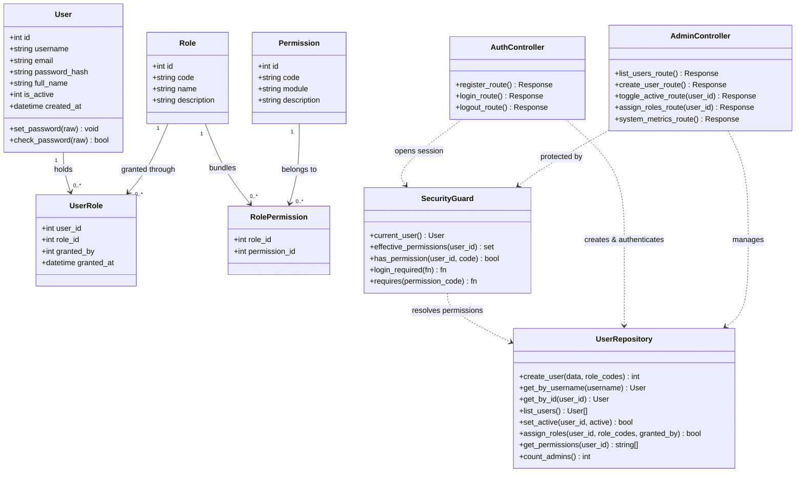
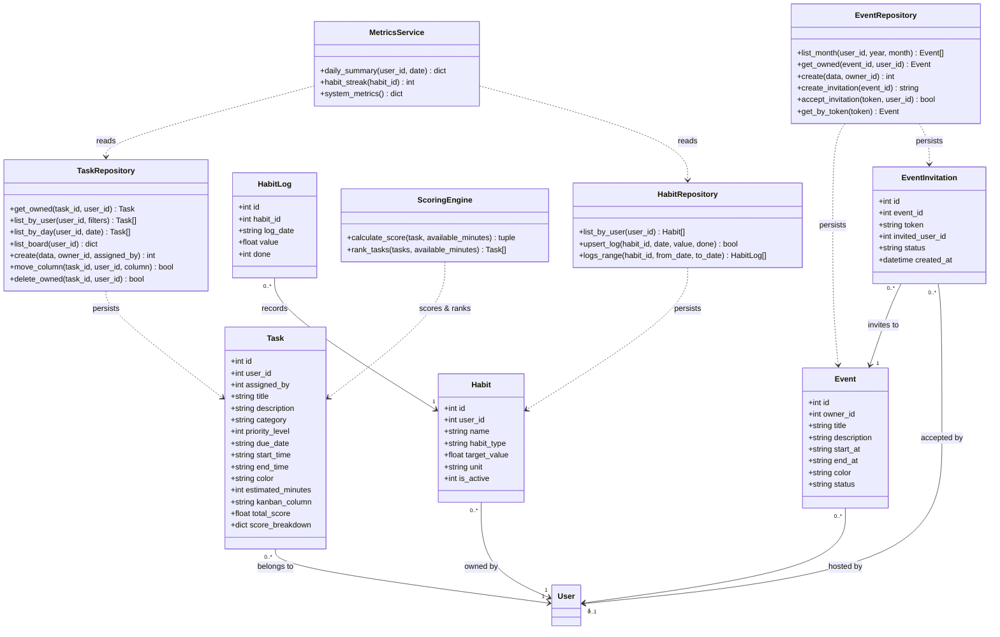
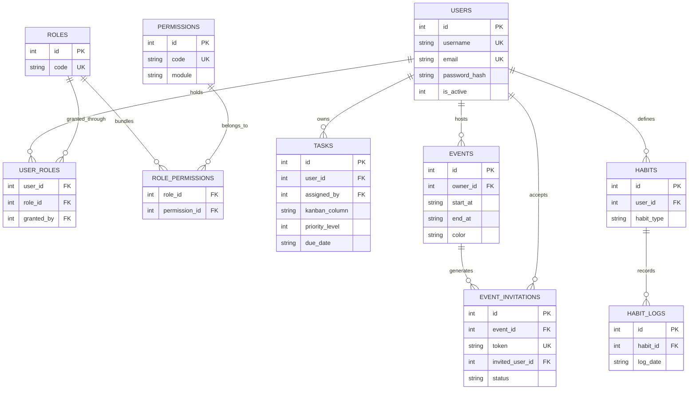
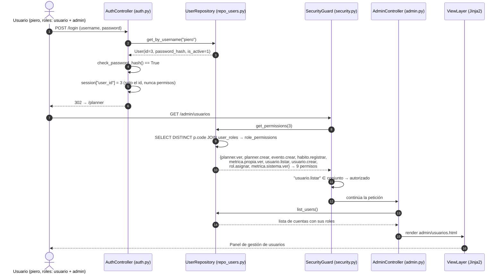
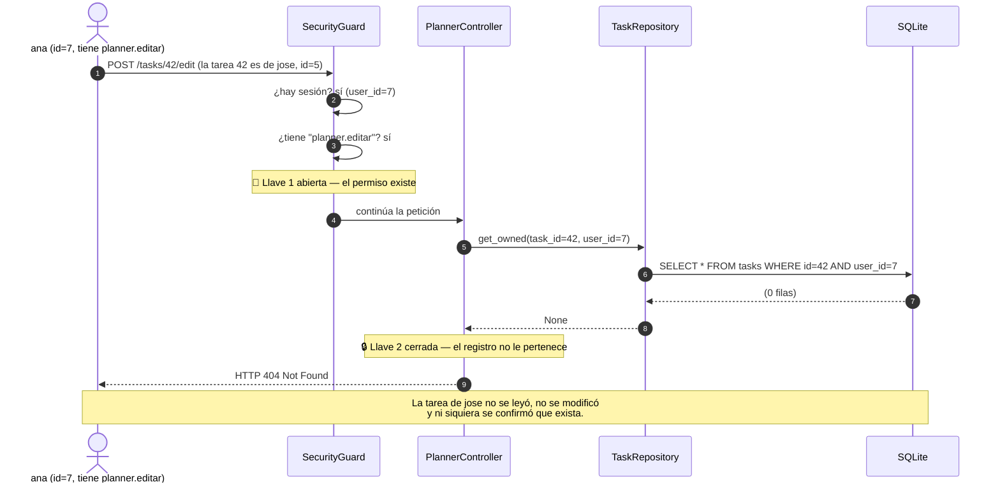
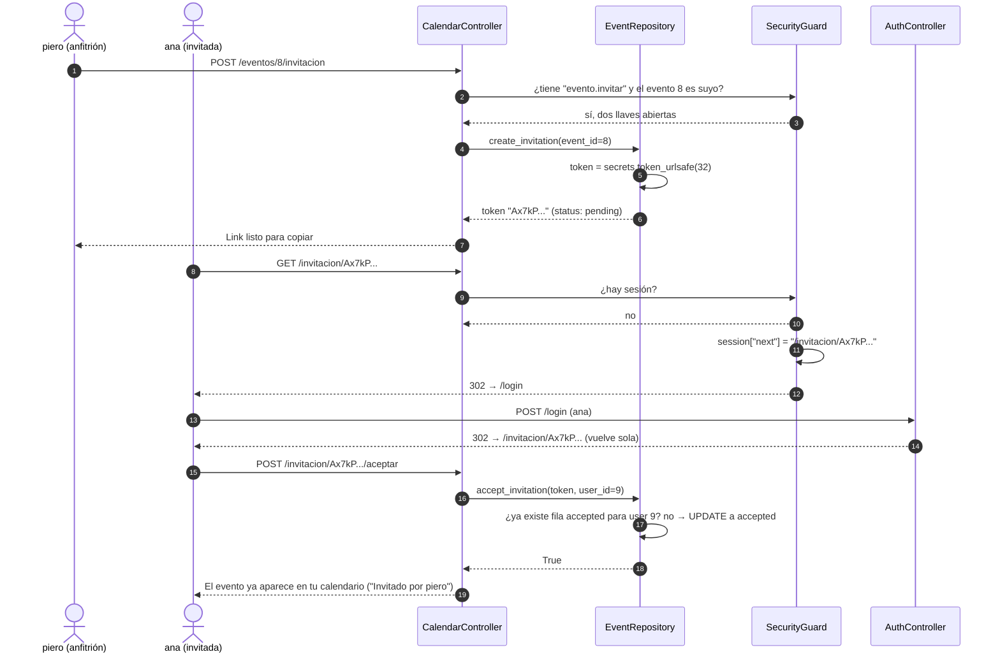
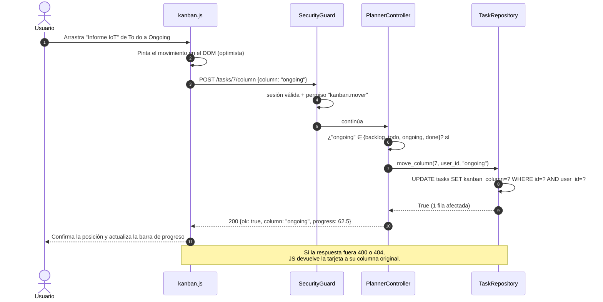
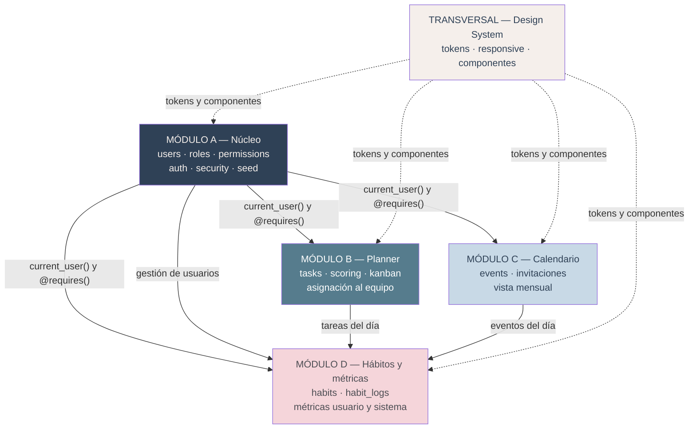

# 📋 VUP Phase 3: Elaboration Phase II Document

**Project Name:** VibePlanner — Multi-User Activity Planner with Transparent Prioritization
**Version:** 2.0 (Update — Multiusuario, Roles y Permisos)
**Phase:** Elaboration Phase II (Architecture, Playbook & UML Diagrams)

---

## 🏛️ 1. System Architecture Components

La v1 tenía cuatro componentes. La v2 tiene once, y la razón de cada uno es
**una sola responsabilidad**. Si un archivo necesita dos frases con "y" para
explicarse, está mal partido.

| # | Componente | Archivo | Responsabilidad única | Módulo |
|---|---|---|---|---|
| 1 | `FlaskApp` | `app.py` | Crea la instancia `app`, carga la configuración y registra los blueprints. **Nada más.** | A |
| 2 | `SecurityGuard` | `security.py` | Único lugar donde se decide si una petición pasa: `login_required`, `requires(permiso)`, `current_user()`, resolución de permisos efectivos. | A |
| 3 | `AuthController` | `auth.py` (blueprint) | Registro, login, logout, cambio de contraseña. Hashea con `werkzeug.security`. | A |
| 4 | `AdminController` | `admin.py` (blueprint) | Gestión de usuarios, asignación de roles y panel de métricas del sistema. | A |
| 5 | `DatabaseManager` | `database.py` | Conexión por petición, `init_db()`, carga de `schema_v2.sql`. Ningún SQL de negocio. | A |
| 6 | `UserRepository` | `repo_users.py` | Único componente que toca `users`, `roles`, `permissions`, `role_permissions`, `user_roles`. | A |
| 7 | `PlannerController` | `planner.py` (blueprint) | Rutas de tareas, revisión del día, Kanban y asignación al equipo. | B |
| 8 | `TaskRepository` | `repo_tasks.py` | Único componente que toca `tasks`. Toda consulta lleva `user_id`. | B |
| 9 | `ScoringEngine` | `scoring.py` | Fórmula determinista y desglose auditable. **Sin cambios de fórmula respecto a v1.** | B |
| 10 | `CalendarController` + `EventRepository` | `calendar.py`, `repo_events.py` | Eventos mensuales e invitaciones con token. | C |
| 11 | `HabitsController` + `MetricsService` | `habits.py`, `repo_habits.py`, `metrics.py` | Hábitos, rachas, métricas del usuario y agregados del sistema. | D |
| — | `Jinja2 View Layer` | `templates/`, `static/` | Presentación responsive. **Cero lógica de negocio en las plantillas.** | Transversal |

### 1.1 Decisiones de arquitectura y su porqué

**Blueprints sin application factory.** PythonAnywhere ejecuta
`from app import app`. Una *application factory* obligaría a reescribir el WSGI y
a depurar en producción, que es justo donde no hay entorno de staging. Los
blueprints dan la modularidad que necesitamos (cada módulo, un archivo) sin tocar
el contrato de despliegue. **La instancia sigue llamándose `app` a nivel de módulo.**

**Autorización centralizada en `security.py`.** Un `if` de permisos repartido
entre veinte rutas es imposible de auditar y es donde se cuelan los agujeros.
Aquí la única forma de proteger una ruta es el decorador, y el único lugar donde
se decide es un archivo de menos de 150 líneas que cualquiera del equipo puede
leer entero.

**Repositorios en vez de un ORM.** SQL parametrizado directo, como en v1. Un ORM
añadiría una dependencia, migraciones y una curva de aprendizaje que no cabe en
una semana; y el motor de puntaje ya demostró que el equipo sabe trabajar con
diccionarios.

**El motor de puntaje no se toca.** Es el diferenciador del producto y ya está
probado con asserts. En v2 solo cambia **quién** le pasa las tareas, no **cómo**
las puntúa.

### 1.2 Modelo de permisos

```
users ──< user_roles >── roles ──< role_permissions >── permissions
```

Cuatro tablas y dos tablas puente. La consulta que resuelve todo:

```sql
SELECT DISTINCT p.code
FROM   user_roles      ur
JOIN   role_permissions rp ON rp.role_id = ur.role_id
JOIN   permissions      p  ON p.id       = rp.permission_id
WHERE  ur.user_id = ?;
```

Esa consulta **es** la definición de "roles agregativos": un usuario con dos roles
recibe la unión de ambos conjuntos, sin duplicados gracias al `DISTINCT`, y sin
que ningún nombre de rol aparezca escrito en el código de los controladores.

**Catálogo de roles**

| Rol | Se otorga | Permisos que aporta |
|---|---|---|
| `usuario` | Automático al registrarse. **Todos lo tienen, siempre.** | Su planner, su kanban, su calendario, sus hábitos, sus métricas |
| `lider` | Solo un administrador lo asigna | `tarea.asignar`, `tarea.ver_equipo` |
| `admin` | Semilla inicial, o asignado por otro administrador | `usuario.*`, `rol.asignar`, `metrica.sistema.ver` |

Un administrador real tiene **dos** filas en `user_roles`: `usuario` y `admin`.
Por eso puede planear su propio día y administrar el sistema con la misma cuenta.

### 1.3 La regla de las dos llaves 🔑🔑

> **Permiso ≠ propiedad.** Toda ruta que opera sobre un registro concreto
> comprueba **dos** cosas: que el usuario tenga el permiso, y que el registro le
> pertenezca (o le haya sido asignado). Si falla la propiedad se responde **404**,
> no 403: un 403 confirmaría al atacante que ese id existe.

```python
@planner.route("/tasks/<int:task_id>/edit", methods=["POST"])
@login_required
@requires("planner.editar")                 # llave 1: el permiso
def edit_task(task_id):
    task = repo_tasks.get_owned(task_id, current_user().id)   # llave 2: la propiedad
    if task is None:
        abort(404)
    ...
```

`repo_tasks.get_owned()` lleva el `user_id` **dentro del `WHERE`**. No se traen
los datos para filtrarlos después en Python: si la fila no es tuya, la base de
datos ni siquiera te la entrega.

---

## 🎭 2. Collaboration Plays & Playbook Scenarios

Cinco obras. Cada personaje es un componente real de la tabla anterior — no se
inventan personajes.

### Play 1 — "Quién eres y qué puedes hacer" (US5, US6)

**Escena bajo prueba:** TC 6.1 — `piero` tiene los roles `usuario` y `admin`;
al entrar debe poder abrir tanto su planner como el panel de administración.

- **Navegador → AuthController:** `POST /login` con usuario `piero` y su contraseña.
- **AuthController → UserRepository:** dame la fila de `piero`.
- **UserRepository → AuthController:** aquí está, con `password_hash` e `is_active = 1`.
- **AuthController (verificando):** `check_password_hash()` da verdadero y la cuenta está activa. Guardo **solo el id** en la sesión — nunca los permisos, nunca el rol.
- **Navegador → SecurityGuard:** `GET /admin/usuarios`.
- **SecurityGuard → UserRepository:** ¿qué permisos efectivos tiene el usuario 3?
- **UserRepository (uniendo roles):** de `usuario` traigo 5, de `admin` traigo 4. Sin duplicados: 9 códigos.
- **SecurityGuard:** `usuario.listar` está en el conjunto. Pasa.
- **AdminController → ViewLayer:** renderiza el listado de cuentas.

> **Por qué la sesión guarda solo el id:** si guardara los permisos, quitarle un
> rol a alguien no tendría efecto hasta que cerrara sesión (TC 6.3). Se resuelven
> por petición. Es una consulta indexada y barata.

---

### Play 2 — "Esta tarea no es tuya" (US1 TC 1.3, US6 TC 6.4)

**Escena bajo prueba:** TC 6.4 — `ana` tiene `planner.editar`, pero la tarea #42
es de `jose`.

- **Navegador de ana → SecurityGuard:** `POST /tasks/42/edit`.
- **SecurityGuard:** hay sesión y `planner.editar` está en sus permisos. **Llave 1 abierta.**
- **PlannerController → TaskRepository:** dame la tarea 42 **que pertenezca al usuario 7**.
- **TaskRepository (a SQLite):** `SELECT * FROM tasks WHERE id = 42 AND user_id = 7` → ninguna fila.
- **TaskRepository → PlannerController:** `None`.
- **PlannerController:** `abort(404)`. **Llave 2 cerrada.** La tarea de `jose` no se leyó, no se modificó y ni siquiera se confirmó que exista.

---

### Play 3 — "El plan de hoy, explicado" (US2, US4, US8)

**Escena bajo prueba:** TC 4.1 — la tarea A está #1 con 90 puntos y el modal debe
mostrar 50 + 40 + 0.

- **Navegador → PlannerController:** `GET /planner`.
- **SecurityGuard:** sesión válida, tiene `planner.ver`. Pasa.
- **PlannerController → TaskRepository:** las tareas activas **del usuario 3**.
- **TaskRepository:** cuatro filas, todas con `user_id = 3`.
- **PlannerController → ScoringEngine:** ordénalas con 120 minutos disponibles.
- **ScoringEngine (calculando):** para la tarea A, prioridad Alta = 50, vence hoy = 40, dura 45 min y no entran en... sí entran, pero el bono ya se aplicó en otra. Total 90, y el desglose viaja con cada número que lo produjo.
- **PlannerController → ViewLayer:** renderiza el plan con los desgloses.
- **Usuario → JS → PlannerController:** clic en la insignia → `GET /api/task/12/score-breakdown`.
- **PlannerController → TaskRepository:** la tarea 12 **del usuario 3** (llave 2 otra vez).
- **ScoringEngine → JS:** `{total: 90, breakdown: {prioridad: 50, urgencia: 40, tiempo: 0}}`.
- **ViewLayer → Usuario:** el modal muestra las tres líneas y la suma coincide con la insignia.

---

### Play 4 — "Te invito con un link" (US12)

**Escena bajo prueba:** TC 12.1 — `piero` invita, `ana` acepta, el evento aparece
en el calendario de `ana`.

- **piero → CalendarController:** `POST /eventos/8/invitacion`.
- **SecurityGuard:** tiene `evento.invitar`; el evento 8 es suyo. Dos llaves abiertas.
- **CalendarController → EventRepository:** crea una invitación con `secrets.token_urlsafe(32)`.
- **EventRepository → CalendarController:** token `Ax7...`, estado `pending`.
- **CalendarController → piero:** aquí está tu link, cópialo.
- **ana → CalendarController:** abre `/invitacion/Ax7...`.
- **SecurityGuard:** no hay sesión → guarda el destino y manda al login (TC 12.3).
- **ana → AuthController:** inicia sesión → **regresa sola** a la pantalla de aceptación.
- **ana → CalendarController:** "Aceptar".
- **CalendarController → EventRepository:** marca `accepted` con `invited_user_id = 9`. Si ya estaba aceptada, no inserta nada (TC 12.4).
- **CalendarController → ViewLayer:** el evento aparece en el calendario de `ana` con la etiqueta "Invitado por piero".

---

### Play 5 — "Cómo me fue hoy" (US13, US14)

**Escena bajo prueba:** TC 14.1 — 6 completadas de 8, repartidas en tres secciones.

- **Navegador → HabitsController:** `GET /metricas`.
- **SecurityGuard:** tiene `metrica.propia.ver`. Pasa.
- **MetricsService → TaskRepository:** tareas de hoy del usuario 3, agrupadas por sección.
- **TaskRepository:** Trabajo 3 de 4, Personal 1 de 2, Actividades 2 de 2.
- **MetricsService → HabitRepository:** hábitos de hoy del usuario 3.
- **HabitRepository:** 2 marcados de 3 definidos.
- **MetricsService (calculando):** 6 de 8 → 75 %. Los hábitos se reportan aparte, **no** entran en ese porcentaje (TC 14.3). Si el total fuera 0, devuelvo 0 % en lugar de dividir (TC 14.2).
- **ViewLayer → Usuario:** tres tarjetas por sección, la barra de cumplimiento y "2 / 3 hábitos".

---

## 📊 3. UML Diagrams (Mermaid GFM)

### 3.1 Diagrama de clases — Módulo A (Núcleo)



### 3.2 Diagrama de clases — Módulos B, C y D



### 3.3 Diagrama entidad-relación



### 3.4 Diagrama de secuencia 1 — Login y resolución de permisos agregativos



### 3.5 Diagrama de secuencia 2 — La regla de las dos llaves (edición ajena bloqueada)



### 3.6 Diagrama de secuencia 3 — Invitación por link



### 3.7 Diagrama de secuencia 4 — Kanban: mover una tarjeta



---

## 🤖 4. AI Critique Record — aceptado / rechazado / cambiado

> Registro obligatorio de la rúbrica: qué propuso la IA en esta fase y qué
> decidimos nosotros. La evidencia de los prompts está en `docs/prompts/`.

### ❌ RECHAZADO

1. **Flask-Login + Flask-Principal + Flask-SQLAlchemy + Alembic.**
   La IA propuso resolver autenticación y permisos con cuatro extensiones y un
   sistema de migraciones. Rechazado: multiplica por cinco las dependencias de un
   proyecto cuyo `requirements.txt` tiene una sola línea, obliga a aprender el
   ciclo de vida de Alembic en una semana, y la funcionalidad que aportan cabe en
   `security.py` + `repo_users.py`, que además podemos auditar completos en clase.
   `werkzeug.security` ya viene con Flask: hashear no cuesta una dependencia nueva.

2. **Una columna `role` de texto en la tabla `users`.**
   La propuesta "más simple" era `users.role = 'admin' | 'user'`. Rechazada
   frontalmente: hace imposible el requisito central de esta versión — que los
   roles sean **agregativos** y que un administrador sea también un usuario
   normal. Con una columna de texto habría que elegir uno de los dos, o crear
   cuentas duplicadas.

3. **Caché de permisos en la cookie de sesión.**
   La IA sugirió guardar la lista de permisos en la sesión "para evitar consultas".
   Rechazado: rompe TC 6.3 (revocación inmediata) y convierte un dato de seguridad
   en algo que vive en el cliente. La consulta va sobre índices y cuesta menos que
   el riesgo.

4. **Notificaciones por correo para las invitaciones.**
   Rechazado: está explícitamente fuera de alcance (§2.2 de Inception) y
   PythonAnywhere free tier no permite SMTP saliente. El link copiable cumple el
   requisito sin red externa.

5. **Migrar el frontend a React + una librería de calendario.**
   Rechazado por la misma razón que en v1: el curso evalúa Flask, Jinja2 y JS
   propio. Además, cualquier librería por CDN es un riesgo el día de la
   presentación si la red del aula falla.

### 🔄 CAMBIADO

6. **La IA generó `@admin_required` como decorador.**
   Cambiado a `@requires("usuario.listar")`. Un decorador que comprueba el
   **nombre del rol** vuelve a meter el rol en el código y anula la tabla de
   permisos: si mañana se crea el rol `soporte` con ese permiso, `@admin_required`
   lo dejaría fuera. Los decoradores comprueban permisos, nunca roles.

7. **El primer `add_task_route()` aceptaba `user_id` del formulario.**
   Cambiado: el dueño sale **siempre** de la sesión. El único caso en que otro
   usuario puede ser dueño es la asignación de US10, y ese camino exige el permiso
   `tarea.asignar` y valida que el destinatario exista y esté activo.

8. **Estados duplicados: `status` (v1) + `kanban_column` (v2).**
   La IA propuso mantener ambas columnas. Cambiado a **una sola** columna con
   cuatro valores (`backlog | todo | ongoing | done`) y un mapeo explícito desde
   v1 (`pending→todo`, `in_progress→ongoing`, `completed→done`). Dos columnas para
   el mismo concepto se desincronizan en la primera semana.

9. **`get_daily_progress()` global.**
   Cambiado a `daily_summary(user_id, date)`. La versión heredada de v1 contaba
   las tareas de **toda** la base de datos: en multiusuario eso significa que tu
   barra de progreso reflejaría el trabajo de desconocidos.

### ✅ ACEPTADO

10. **`secrets.token_urlsafe(32)` para los tokens de invitación.**
    Aceptado: es librería estándar, criptográficamente seguro y hace impracticable
    adivinar un link. La alternativa que teníamos pensada (un id incremental)
    habría permitido recorrer todas las invitaciones del sistema cambiando un número.

11. **Responder 404 en vez de 403 cuando el registro no es tuyo.**
    Aceptado: un 403 confirma que ese id existe y permite enumerar registros
    ajenos. Es una mejora de seguridad real que no habríamos considerado.

12. **`PRAGMA journal_mode=WAL` y `timeout` en la conexión.**
    Aceptado: mitiga el riesgo R8 (`database is locked`) al permitir lecturas
    concurrentes mientras hay una escritura. Cambia una línea y evita el fallo más
    probable durante la demo con varios usuarios simultáneos.

13. **Índices en `tasks(user_id, due_date)`, `events(owner_id, start_at)` y `user_roles(user_id)`.**
    Aceptado: son exactamente las tres columnas por las que filtra cada petición.

---

## 🗺️ 5. Mapa de módulos y dependencias



**Lectura del mapa:** el Módulo A no depende de nadie y **todos dependen de él**.
Por eso se construye primero y su contrato (`current_user()`, `@login_required`,
`@requires()`) se congela antes de que los demás escriban una línea. El Módulo D
consume datos de B y C, así que es el último en cerrarse. El Design System es
transversal y puede avanzar en paralelo desde el día uno.
