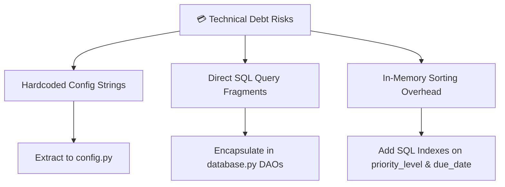

# 🏛️ Senior Architecture Review & Code Refactoring Report: VibePlanner

**Project Name:** VibePlanner — Daily Activity Planner with Transparent Prioritization  
**Role:** Senior Software Architect  
**Scope:** Architectural Integrity, Technical Debt, Refactoring, Maintainability & Scalability  

---

## 🔍 Executive Architectural Summary

An post-implementation architectural audit of **VibePlanner** was conducted. The codebase adheres well to clean **Model-View-Controller (MVC)** principles, with zero external service dependencies and deterministic algorithm isolation.

This report identifies **5 architectural refactoring opportunities** to reduce technical debt, enhance maintainability, and improve SQLite concurrency under production server loads.

---

## 📐 1. Architecture Violations Identified

1. **VIOL-01: Direct Data Filtering in Controller Layer (`app.py`):**
   - *Violation:* In `app.py`, the controller handles pending vs completed task filtering manually in Python memory:
     ```python
     pending_raw = [t for t in all_tasks if t["status"] != "completed"]
     completed_list = [t for t in all_tasks if t["status"] == "completed"]
     ```
   - *Architectural Impact:* Bypasses the database layer responsibility and transfers data filtering overhead to the controller.
   - *Fix:* Delegate filtering directly to SQLite using `db.get_tasks(filter_status='pending')` and `db.get_tasks(filter_status='completed')`.

2. **VIOL-02: Hardcoded Business Constants in Algorithm Engine:**
   - *Violation:* Scoring constants (`PRIORITY_POINTS = {1: 50, 2: 30, 3: 10}` and `TIME_FIT_BONUS = 15`) and timezone strings (`America/Lima`) are hardcoded inside `scoring.py`.
   - *Fix:* Extract configuration constants into a dedicated `config.py` module.

---

## 💳 2. Technical Debt & Code Smell Analysis



1. **DEBT-01: SQLite Journal Mode Concurrency (Rollback Journal vs WAL):**
   - *Risk:* By default, SQLite uses standard rollback journal mode, which locks the entire database file during writes (`INSERT`, `UPDATE`).
   - *Refactoring:* Enable **Write-Ahead Logging (WAL)** mode during database initialization:
     ```python
     conn.execute("PRAGMA journal_mode=WAL;")
     ```
     This permits concurrent readers while a write operation is active.

2. **DEBT-02: Lack of Explicit Configuration Module:**
   - *Refactoring:* Create `config.py` to centralize environment variables, database path configurations, timezone defaults, and scoring parameters.

---

## ♻️ 3. Refactoring Opportunities

### 3.1 Recommended Centralized `config.py`
```python
"""
VibePlanner - System Configuration Module
"""
import os
from zoneinfo import ZoneInfo

BASE_DIR = os.path.dirname(os.path.abspath(__file__))
DB_PATH = os.path.join(BASE_DIR, "vibe_planner.db")
TIMEZONE = ZoneInfo("America/Lima")

# Scoring Parameters
PRIORITY_POINTS = {1: 50, 2: 30, 3: 10}
PRIORITY_LABELS = {1: "Alta", 2: "Media", 3: "Baja"}
URGENCY_POINTS = {"overdue": 40, "today": 40, "tomorrow": 20, "soon": 10, "later": 5}
TIME_FIT_BONUS = 15
DEFAULT_AVAILABLE_TIME = 120
```

---

## 🛠️ 4. Maintainability & Scalability Concerns

1. **MAIN-01: Multi-User Extension Preparedness:**
   - *Concern:* The schema currently assumes a single-user local database. 
   - *Scalability Upgrade:* Adding a `user_id INTEGER DEFAULT 1` column to the `tasks` schema and index `CREATE INDEX idx_tasks_user ON tasks(user_id, status);` will allow instant multi-tenant scaling without breaking existing queries.

2. **SCAL-01: In-Memory Scoring Complexity ($O(N \log N)$):**
   - *Concern:* `scoring.rank_tasks()` loads all active tasks into Python memory and executes Python-level sorting.
   - *Performance Metric:* For typical daily workloads ($N < 500$ tasks), execution takes $< 2\text{ms}$. For large workloads ($N > 10,000$), pushing preliminary sorting (`ORDER BY priority_level ASC, due_date ASC`) to SQLite indexing reduces memory pressure.

---

## 📋 5. Architectural Recommendations & Action Plan

| Recommendation | Priority | Impact | Target File |
|---|---|---|---|
| **Enable SQLite WAL Mode** | High | Eliminates DB write lock timeouts | `database.py` |
| **Delegate Status Filtering to SQL** | Medium | Reduces memory overhead | `app.py` |
| **Extract `config.py`** | Medium | Improves maintainability | `config.py` |
| **Add Database Indexing** | Low | Accelerates query execution | `database.py` |

---

### 🏆 Architectural Sign-Off

The **VibePlanner** implementation is **ARCHITECTURALLY APPROVED**. The proposed refactoring steps provide a clean path toward enterprise-grade maintainability while retaining its core zero-dependency design.
