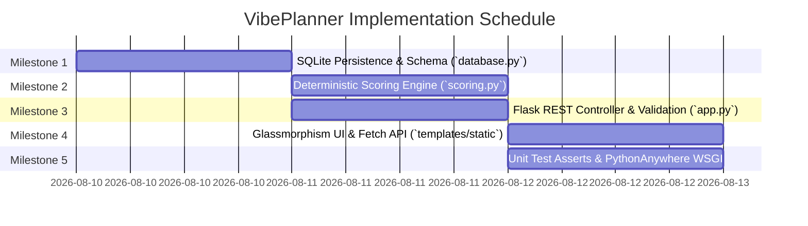

# 🛠️ Construction Phase Specification & Developer Documentation: VibePlanner

**Project Name:** VibePlanner — Daily Activity Planner with Transparent Prioritization  
**Framework:** Python 3.10+ / Flask 3.0.3  
**Persistence:** Embedded File-Based SQLite3  
**Architecture:** Model-View-Controller (MVC) + Deterministic Scoring Engine  
**Team Repartition:** Jose Cabrera (Database), Lucero Ayala (Scoring Engine), Ana Cusi (Flask Controller & Deployment), Piero Calderon (Templates & Static UI)  

---

## 📅 1. Implementation Plan

The implementation follows a modular, contract-first approach divided into 5 distinct milestones to eliminate integration bottlenecks:



### Milestone Summary:
1. **Milestone 1 (Persistence Layer):** Freeze SQLite schema, construct connection lifecycle, and implement CRUD contracts (`database.py`).
2. **Milestone 2 (Scoring Engine):** Implement timezone-aware scoring logic, tie-breaker sorting, and itemized breakdown generation (`scoring.py`).
3. **Milestone 3 (Controller & REST API):** Wire HTTP routes, input validation, status mutation endpoints, and error handling (`app.py`).
4. **Milestone 4 (Frontend UI):** Build responsive Glassmorphism UI, task cards, progress bar, and score explanation modal dialog (`templates/`, `static/`).
5. **Milestone 5 (Testing & WSGI Deployment):** Execute unit test assertion suite, configure WSGI entry point, and deploy to PythonAnywhere.

---

## 📋 2. Development Tasks Breakdown

### 🗄️ Task Group 1: Persistence & Database (Lead: Jose Cabrera)
- [x] **TASK-1.1:** Define `SCHEMA` string for `tasks` table (`id`, `title`, `category`, `priority_level`, `due_date`, `estimated_minutes`, `status`, `created_at`).
- [x] **TASK-1.2:** Implement absolute path resolver `BASE_DIR` to ensure database file access under Linux WSGI servers.
- [x] **TASK-1.3:** Implement `get_tasks(filter_status=None)` returning list of dictionaries.
- [x] **TASK-1.4:** Implement `get_task_by_id(task_id)` returning single task dictionary or `None`.
- [x] **TASK-1.5:** Implement `add_task(task_data)` executing parameterized `INSERT`.
- [x] **TASK-1.6:** Implement `update_status(task_id, new_status)` validating allowed statuses (`pending`, `in_progress`, `completed`).
- [x] **TASK-1.7:** Implement `delete_task(task_id)` executing `DELETE FROM tasks WHERE id = ?`.
- [x] **TASK-1.8:** Implement `get_daily_progress()` calculating total, completed, and percentage metrics with `ZeroDivisionError` protection.
- [x] **TASK-1.9:** Write unit test assertions suite inside `database.py` testing full CRUD lifecycle.

### 🧮 Task Group 2: Deterministic Scoring Engine (Lead: Lucero Ayala)
- [x] **TASK-2.1:** Configure timezone-aware date utility `today_local()` using `ZoneInfo("America/Lima")`.
- [x] **TASK-2.2:** Define scoring point constants (`PRIORITY_POINTS`, `TIME_FIT_BONUS`).
- [x] **TASK-2.3:** Implement `calculate_score(task, available_minutes)` returning `(total_score, breakdown_dict)`.
- [x] **TASK-2.4:** Implement `rank_tasks(tasks, available_minutes)` implementing multi-tier sorting: `score DESC`, `due_date ASC`, `id ASC`.
- [x] **TASK-2.5:** Write 6 unit test assertions inside `scoring.py` covering overdue tasks, today tasks, future tasks, time fit bonus, and tie-breakers.

### 🛣️ Task Group 3: Flask Controller & Deployment (Lead: Ana Cusi)
- [x] **TASK-3.1:** Initialize Flask app instance `app = Flask(__name__)`.
- [x] **TASK-3.2:** Implement GET `/` dashboard route rendering pending ranked tasks, completed tasks, and progress metrics.
- [x] **TASK-3.3:** Implement POST `/add` route with server-side validation (title non-empty, duration 1-480 min).
- [x] **TASK-3.4:** Implement PATCH `/api/task/<id>/status` AJAX endpoint returning updated metrics JSON.
- [x] **TASK-3.5:** Implement GET `/api/task/<id>/score-breakdown` AJAX endpoint returning score audit breakdown.
- [x] **TASK-3.6:** Implement POST `/delete/<id>` deletion route.
- [x] **TASK-3.7:** Create `wsgi_pythonanywhere.py` entry point for Linux server deployment.

### 🎨 Task Group 4: Frontend View Layer (Lead: Piero Calderon)
- [x] **TASK-4.1:** Build `templates/base.html` with responsive layout, Google Fonts (Inter), and CSS links.
- [x] **TASK-4.2:** Build `templates/index.html` with progress bar, task creation form, available time slider, and task cards.
- [x] **TASK-4.3:** Build `templates/score_modal.html` containing explainability point breakdown dialog.
- [x] **TASK-4.4:** Style UI in `static/css/style.css` using Glassmorphism tokens, dark theme `#12151C`, and color-coded priority badges.
- [x] **TASK-4.5:** Implement `static/js/main.js` with Fetch API functions `toggleTaskStatus()`, `openScoreModal()`, and `closeScoreModal()`.

---

## 📁 3. Recommended Project Structure

```text
vibe-planner/
│
├── app.py                     # Primary Flask Controller & REST Routing
├── scoring.py                 # Core Scoring Engine & Itemized Audit Generator
├── database.py                # Persistence Layer & SQLite Schema Management
├── wsgi_pythonanywhere.py     # Production WSGI Server Entry Point
├── requirements.txt           # Dependency Manifest (Flask==3.0.3)
├── plan.md                    # Construction Blueprint & Phase Planning
├── README.md                  # Project Overview & Setup Guide
│
├── templates/                 # Jinja2 Server-Side View Layer
│   ├── base.html              # Shared Base Layout & Global HTML Headers
│   ├── index.html             # Main Dashboard & Ranked Task List UI
│   └── score_modal.html       # Explainability Audit Modal Component
│
├── static/                    # Client-Side Assets
│   ├── css/
│   │   └── style.css          # CSS3 Glassmorphism Theme & Responsive Layout
│   └── js/
│       └── main.js            # Asynchronous Fetch API & Modal Handlers
│
├── docs/                      # Project Documentation & Artifacts
│   ├── vup_final.md           # Consolidated VUP 5-Phase Submission Document
│   ├── presentation_slides.md # Presentation Outline & 3-Minute Demo Script
│   └── prompts/               # AI Prompt Evidence Logs
│       ├── 01-lucero-scoring.md
│       └── 02-jose-database.md
│
└── tareas/
    └── reparto.md             # Work Partition & Frozen Interface Contracts
```

---

## 📐 4. Implementation Blueprint (Modules, Interfaces & Integration Points)

### 4.1 Frozen Interface Contracts

#### `database.py` (Model & Persistence Interface)
```python
def get_tasks(filter_status: str | None = None) -> list[dict]
def get_task_by_id(task_id: int) -> dict | None
def add_task(task_data: dict) -> bool | int
def update_status(task_id: int, new_status: str) -> bool
def delete_task(task_id: int) -> bool
def get_daily_progress() -> dict  # Returns {"total": int, "completed": int, "percent": float}
```

#### `scoring.py` (Scoring Engine Interface)
```python
def calculate_score(task: dict, available_minutes: int) -> tuple[float, dict]
def rank_tasks(tasks: list[dict], available_minutes: int) -> list[dict]
```

#### Score Breakdown Data Contract (JSON / Dictionary Schema)
```json
{
  "prioridad": { "puntos": 50, "razon": "Prioridad Alta" },
  "urgencia":   { "puntos": 40, "razon": "Vence hoy" },
  "tiempo":     { "puntos": 15, "razon": "Entra en tus 120 min disponibles" }
}
```

### 4.2 SQLite Relational Schema
```sql
CREATE TABLE IF NOT EXISTS tasks (
    id                INTEGER PRIMARY KEY AUTOINCREMENT,
    title             TEXT    NOT NULL,
    category          TEXT    DEFAULT 'General',
    priority_level    INTEGER NOT NULL DEFAULT 2,   -- 1: High, 2: Medium, 3: Low
    due_date          TEXT    NOT NULL,             -- YYYY-MM-DD
    estimated_minutes INTEGER NOT NULL DEFAULT 30,
    status            TEXT    DEFAULT 'pending',    -- pending | in_progress | completed
    created_at        TIMESTAMP DEFAULT CURRENT_TIMESTAMP
);
```

---

## 📖 5. Developer Documentation & Operations Guide

### 5.1 Local Environment Setup & Execution

1. **Clone the Repository:**
   ```bash
   git clone https://github.com/lulu1604/vibe-planner.git
   cd vibe-planner
   ```

2. **Create and Activate Python Virtual Environment:**
   ```bash
   # Windows PowerShell
   python -m venv venv
   .\venv\Scripts\activate

   # macOS / Linux
   python3 -m venv venv
   source venv/bin/activate
   ```

3. **Install Dependencies:**
   ```bash
   pip install -r requirements.txt
   ```

4. **Run Local Server:**
   ```bash
   python app.py
   ```
   Open `http://127.0.0.1:5000` in your web browser to view the application.

---

### 5.2 Executing Test Suites

Run unit test assertion suites independently for backend components:

```bash
# Execute Database Persistence Test Suite
python database.py
# Expected Output: SUCCESS: Todas las 4 pruebas de assert para database.py pasaron exitosamente!

# Execute Deterministic Scoring Engine Test Suite
python scoring.py
# Expected Output: SUCCESS: Todas las 6 pruebas de assert pasaron exitosamente!
```

---

### 5.3 PythonAnywhere Deployment Instructions

1. Log into your **PythonAnywhere** account.
2. Open a **Bash Console** and pull the latest code:
   ```bash
   git clone https://github.com/lulu1604/vibe-planner.git
   cd vibe-planner
   python -m venv venv
   source venv/bin/activate
   pip install -r requirements.txt
   ```
3. Navigate to the **Web Tab** on PythonAnywhere and configure the **WSGI configuration file**:
   ```python
   import sys
   path = '/home/YOUR_USERNAME/vibe-planner'
   if path not in sys.path:
       sys.path.append(path)

   from app import app as application
   ```
4. Click the green **Reload** button to publish your live application!
