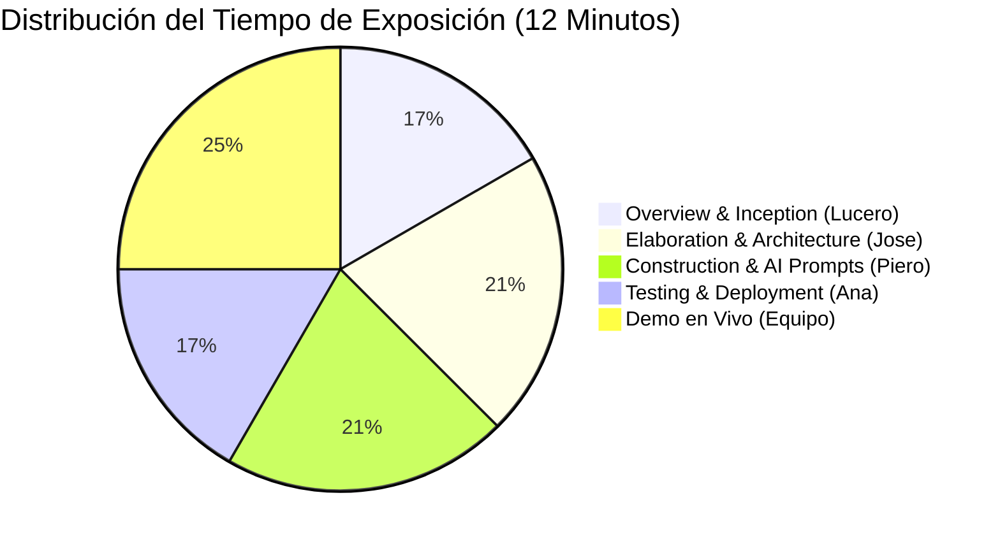

# 🎤 Guía de Presentación Final y Diapositivas (10–13 Minutos) — VibePlanner

**Curso:** Fundamentals of Vibe Coding — ESAN Global Week 2026  
**Proyecto:** VibePlanner — Planificador Diario Transparente  
**Formato:** Diapositivas sencillas + **DEMO EN VIVO**  
**Participación:** 4 Integrantes (Lucero, Jose, Piero, Ana)  

---

## ⏱️ Distribución del Tiempo (10 a 13 Minutos Total)

---

## 📊 Estructura de las Diapositivas (Diapo por Diapo)

### 🔹 Diapositiva 1: Project Overview (1.5 min - Habla Lucero)
* **Título:** VibePlanner — Planificador Diario Inteligente y Transparente.
* **Equipo:** Lucero Ayala, Jose Cabrera, Piero Calderón, Ana Cusi.
* **Problema:** Los estudiantes pierden tiempo decidiendo qué tarea empezar frente a listas largas (*parálisis por análisis*).
* **Solución:** Una app web que ordena automáticamente las tareas por urgencia y prioridad, explicando el desglose exacto de puntos.

### 🔹 Diapositiva 2: Inception & Requerimientos (1.5 min - Habla Lucero)
* **Las 4 Historias de Usuario (User Stories):**
  1. *Crear/Editar/Eliminar actividades.*
  2. *Ordenamiento automático determinista por puntaje.*
  3. *Cambio de estado y barra de progreso en tiempo real.*
  4. *Modal de Explicabilidad ("¿Por qué esta tarea está primero?").*
* **Out of Scope:** Sin login/cuentas, sin APIs pagadas de IA, sin sincronización de calendario. 100% autocontenido.

### 🔹 Diapositiva 3: Elaboration & Arquitectura UML (2 min - Habla Jose)
* **Patrón MVC Autocontenido:** Front-end Jinja2 + CSS Glassmorphism, Backend Flask, Base de Datos SQLite3.
* **Fórmula de Scoring Transparente:**
  $$\text{Total} = P_{\text{Prioridad}} (10\text{-}50) + P_{\text{Urgencia}} (5\text{-}40) + P_{\text{Tiempo}} (0\text{ o }15)$$
* **Diagrama de Clases & Secuencia:** Mostrar cómo `FlaskController`, `ScoringEngine` y `DatabaseManager` colaboran para responder a la petición del modal de explicabilidad.

### 🔹 Diapositiva 4: Construction & Prompts de IA (2 min - Habla Piero)
* **Uso de IA en el Desarrollo:** Asistencia con ChatGPT / Gemini para acelerar plantillas HTML/CSS y consultas SQL.
* **Prompt Clave Registrado:** Demostrar 1-2 prompts usados en `docs/prompts/`.
* **Lo que la IA hizo MAL y se corrigió:**
  * *Rutas Relativas:* La IA usó `vibe_planner.db` (falla en PythonAnywhere). Se corrigió con ruta absoluta `BASE_DIR`.
  * *Zona Horaria:* La IA usó `datetime.now()` UTC (marcarte vencida a las 7 p.m. en Perú). Se corrigió con `America/Lima`.

### 🔹 Diapositiva 5: Testing & Despliegue (2 min - Habla Ana)
* **Estrategia de Pruebas:**
  * 6 Pruebas con `assert` en `scoring.py` (desempate, vencidas, bonos).
  * 4 Pruebas con `assert` en `database.py` (CRUD y división entre cero).
* **Despliegue en Vivo:**
  * GitHub Repo: `https://github.com/lulu1604/vibe-planner`
  * PythonAnywhere URL pública lista.

### 🔹 Diapositiva 6: DEMO EN VIVO (3 min - Todos el Equipo)
* **Paso 1:** Abrir la web app en PythonAnywhere.
* **Paso 2:** Crear una nueva tarea con fecha de hoy y prioridad Alta.
* **Paso 3:** Mostrar cómo se coloca en la posición #1 automáticamente.
* **Paso 4:** Hacer clic en la insignia de puntaje **"¿Por qué?"** y abrir el modal mostrando el desglose transparente de puntos.
* **Paso 5:** Marcar la tarea como completada y mostrar cómo la barra de progreso se anima a 100%.

### 🔹 Diapositiva 7: Lecciones Aprendidas (1 min - Todos)
* **Lo que la IA hizo bien:** Maquetación inicial, sintaxis SQL, tokens de diseño CSS.
* **Lo que la IA hizo mal:** Zonas horarias, manejo de errores de división entre cero, rutas WSGI de servidores de despliegue.
* **Aprendizaje autónomo fuera de clase:** Configuración de rutas absolutas WSGI y reglas de desempate determinista sin librerías pesadas.

---

## 🎯 Consejos para la Exposición

1. **No leas las diapositivas:** Usa texto breve y diagramas visuales.
2. **La Demo en Vivo es la estrella:** Practiquen el flujo de 3 minutos para que no falle nada durante la demostración real.
3. **Muestren el código de los asserts:** Demuestra al profesor que escribieron pruebas unitarias verdaderas.
