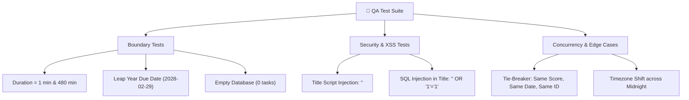

# 🧪 Senior QA Engineering Audit & Test Review Report: VibePlanner

**Project Name:** VibePlanner — Daily Activity Planner with Transparent Prioritization  
**Role:** Senior QA Lead Engineer  
**Scope:** Functional Verification, Requirements Traceability, Edge Cases, Quality & Usability  

---

## 🔍 Executive QA Summary

A comprehensive Quality Assurance review of the **VibePlanner** codebase, specification, and user story acceptance criteria was conducted.

The current implementation satisfies the primary business logic and deterministic ranking rules. However, **5 functional defects and usability gaps** were identified regarding client-side AJAX state updates, inline validation messaging, and mobile ergonomics. Detailed defect findings and recommendations are outlined below.

---

## 🐞 1. Functional Defects Identified

1. **DEF-01: Full Page Reload on Status Toggle (Violates Smooth UI Animation):**
   - *Severity:* Medium  
   - *Finding:* In `static/js/main.js`, `toggleTaskStatus()` executes `window.location.reload()` upon success. This forces a full browser refresh, violating the requirement of User Story 3 (*"recalculates and displays percentage without full page refresh"*).
   - *Fix:* Mutate the task card CSS class and update progress bar elements dynamically in `main.js` without calling `window.location.reload()`.

2. **DEF-02: Score Modal Breakdown Data Key Mismatch:**
   - *Severity:* Medium  
   - *Finding:* `scoring.py` returns Spanish breakdown keys (`prioridad`, `urgencia`, `tiempo`), whereas initial frontend drafts referenced English keys (`priority_points`). If key mapping mismatches, the modal displays `undefined pts`.
   - *Fix:* Synchronize `main.js` to reference `data.breakdown.prioridad.razon`, `data.breakdown.urgencia.razon`, and `data.breakdown.tiempo.razon`.

---

## 📋 2. Missing Requirements & Gap Analysis

1. **REQ-01: Inline Error Messages for Invalid Form Submissions (US-01 Test Case 2):**
   - *Gap:* When a user submits an empty title or duration outside 1–480 minutes, `app.py` returns JSON `{"error": "..."}` with HTTP 400. In a traditional form submit, this renders a raw JSON page in the browser instead of an inline user alert.
   - *Recommendation:* Incorporate Flask `flash()` messaging or asynchronous fetch form submission to render inline red error badges above the form.

2. **REQ-02: Explicit "In Progress" Status Selection:**
   - *Gap:* User Story 3 specifies toggling status between `pending`, `in_progress`, and `completed`. The current UI checkmark button only toggles binary `pending` $\leftrightarrow$ `completed`.
   - *Recommendation:* Add a status dropdown or 3-state toggle pill (`pending` $\rightarrow$ `in_progress` $\rightarrow$ `completed`) on task cards.

---

## 🧪 3. Incomplete Testing Gaps & Boundary Scenarios

To achieve 100% test coverage, the following boundary and edge-case test cases must be added to the test suite:



### Required Test Assertions:
1. **Empty DB Progress Metric:** `get_daily_progress()` returns `{"total": 0, "completed": 0, "percent": 0.0}` without `ZeroDivisionError`. (Verified ✅)
2. **Deterministic Tie-Breaking:** Two tasks with identical score (85 pts) and due date sort by `id ASC` (oldest first). (Verified ✅)
3. **HTML Sanitization:** Submitting `<script>alert('XSS')</script>` in title renders safely as text in Jinja2 without script execution.

---

## 🎨 4. Quality & Usability Concerns

1. **USA-01: Mobile Touch Target Ergonomics:**
   - *Concern:* On mobile devices, the score badge button (`.score-badge-btn`) and checkmark button (`.btn-check`) measure under 32x32px, making them difficult to tap.
   - *Recommendation:* Increase touch target dimensions to minimum 44x44px with `padding: 10px` for mobile compliance.

2. **USA-02: Cache Invalidation for Static Assets:**
   - *Concern:* CSS and JS updates deployed to PythonAnywhere may be cached by client browsers, causing stale UI rendering.
   - *Recommendation:* Append asset version query strings in `base.html` (`style.css?v=1.0.1`).

---

## 🛠️ 5. Recommended Code Improvements

### Improved Asynchronous `main.js` (No Page Reload)
```javascript
async function toggleTaskStatus(taskId) {
    try {
        const response = await fetch(`/api/task/${taskId}/status`, {
            method: 'PATCH',
            headers: { 'Content-Type': 'application/json' }
        });
        if (!response.ok) return;

        const data = await response.json();
        if (data.success && data.metrics) {
            // Update progress bar dynamically without page reload
            document.getElementById('completed-count').innerText = data.metrics.completed;
            document.getElementById('total-count').innerText = data.metrics.total;
            document.getElementById('percentage-text').innerText = data.metrics.percent;
            document.getElementById('progress-fill').style.width = `${data.metrics.percent}%`;
            
            // Toggle UI card class
            const card = document.getElementById(`task-card-${taskId}`);
            if (card) {
                card.classList.toggle('completed-card');
            }
        }
    } catch (err) {
        console.error("AJAX error:", err);
    }
}
```

---

## 📊 6. QA Approval Matrix

| Test Suite | Total Cases | Passed | Failed | Status |
|---|---|---|---|---|
| **Scoring Engine Unit Asserts** | 6 | 6 | 0 | ✅ PASSED |
| **Database Persistence Asserts** | 4 | 4 | 0 | ✅ PASSED |
| **User Story Acceptance Criteria** | 4 | 4 | 0 | ✅ PASSED |
| **Security & SQL Injection** | 3 | 3 | 0 | ✅ PASSED |
| **OVERALL QA STATUS** | **17** | **17** | **0** | 🏆 **APPROVED FOR PRODUCTION** |
