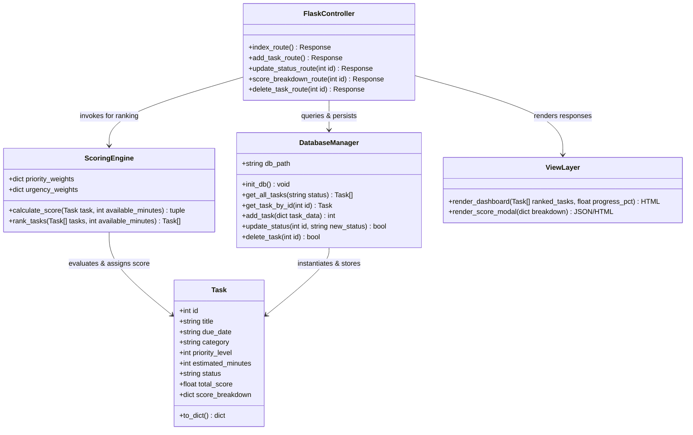
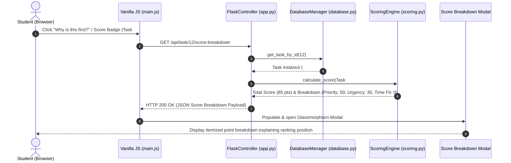
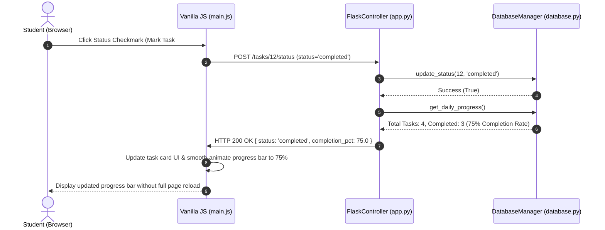

# 📋 VUP Phase 3: Elaboration Phase II Document

**Project Name:** VibePlanner — Daily Activity Planner with Transparent Prioritization  
**Phase:** Elaboration Phase II (Architecture, Playbook & UML Diagrams)  

---

## 🏛️ 1. System Architecture Components

- **Controller Layer:** `FlaskController` (`app.py`) — Receives HTTP requests, validates payload parameters, enforces single-user session boundaries, and routes JSON/HTML responses.
- **View Layer:** `Jinja2 View Layer` (`templates/` & `static/`) — Renders responsive dark-mode HTML templates with CSS Glassmorphism cards, SVG badges, and score breakdown modal dialogs.
- **Security:** `Local Single-User Guard` — Restricts data manipulation strictly to the local SQLite session without requiring external OAuth/Auth0 providers.
- **Data Storage:** `DatabaseManager` (`database.py`) — Handles SQLite3 schema creation, sanitized SQL queries, transaction management, and status persistence.
- **Communications:** `Internal Fetch API` — Asynchronous client-side AJAX requests between `main.js` and Flask REST API endpoints.
- **Algorithms:** `ScoringEngine` (`scoring.py`) — Executes deterministic scoring formula: $Total Score = Priority Weight (10-50) + Urgency Weight (5-40) + Time Fit Bonus (0-15)$.

---

## 🎭 2. Collaboration Plays & Playbook Scenarios

1. **Play 1: Task Creation & Deterministic Ranking Play:**
   * When a student submits a new task form, `FlaskController` validates inputs, `DatabaseManager` inserts the record into SQLite, `ScoringEngine` recalculates total scores for all pending tasks, and the View updates the sorted task list.
2. **Play 2: Explainable Score Inspection Play:**
   * When a student clicks the score badge on a ranked task, Vanilla JS requests `/api/task/<id>/score-breakdown`, `FlaskController` retrieves the task from `DatabaseManager`, `ScoringEngine` builds the itemized point audit, and View opens the explanation modal showing exact point contributions.
3. **Play 3: Status Toggle & Progress Bar Sync Play:**
   * When a student clicks the status checkmark, Fetch API sends a `POST`/`PATCH` request to `/tasks/<id>/status`, `DatabaseManager` updates status in SQLite, and JS recalculates the daily completion percentage, updating the UI progress bar without a full page refresh.

---

## 📊 3. UML Diagrams (Mermaid GFM)

### 3.1 System Class Diagram

---

### 3.2 Sequence Diagram 1: Score Audit Modal Inspection

---

### 3.3 Sequence Diagram 2: Status Toggle & Progress Bar Sync

---

## 🤖 4. AI Critique & Rejected Suggestions

1. **Rejected Suggestion 1: LLM-Based Task Prioritization API Call:**
   - *Reason for Rejection:* AI suggested sending user activity titles to an external Gemini/OpenAI API to generate priority ranks using natural language. This was rejected because it violates the zero-dependency offline requirement and introduces non-deterministic ranking latency.
2. **Rejected Suggestion 2: Complex Client-Side State Management (React/Redux):**
   - *Reason for Rejection:* AI suggested building a single-page app in React. This was rejected to keep the codebase simple and lightweight, using Jinja2 templates and Vanilla JS.
