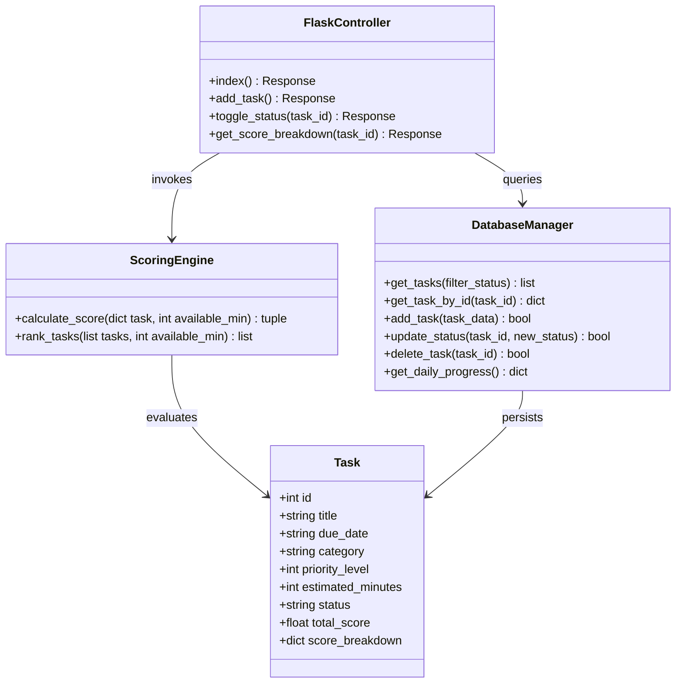

# 🏆 VUP Consolidated Final Project Document: VibePlanner

**Course:** Fundamentals of Vibe Coding — ESAN Global Week 2026  
**Project Name:** VibePlanner — A Daily Activity Planner with Transparent & Explainable Prioritisation  
**Repository:** [https://github.com/lulu1604/vibe-planner.git](https://github.com/lulu1604/vibe-planner.git)  
**Live Application URL:** `http://Josed.pythonanywhere.com` / `http://lulu1604.pythonanywhere.com`  

**Team Members & Roles:**
- **Lucero Sonlange Ayala Mauricio** — Scoring Engine Lead (`scoring.py`)
- **Jose Domingo Cabrera Ticcla** — Persistence & SQL Schema Lead (`database.py`)
- **Piero Jesus Calderon Mendez** — Frontend & UI Lead (`templates/`, `static/`)
- **Ana Luzmila Cusi Apomayta** — Flask Controller & Deployment Lead (`app.py`, `wsgi_pythonanywhere.py`)

---

## 📍 1. Project Overview

### Problem Statement
University students and young professionals frequently suffer from decision fatigue when managing long, undifferentiated to-do lists. Existing tools either act as static lists (Todoist, Notion) or opaque "black box" AI algorithms (Motion, Reclaim) that rank tasks without explaining why.

### Solution
**VibePlanner** is a self-contained, web-based daily activity planner that automatically ranks tasks using a transparent, explainable scoring formula and displays an itemized mathematical audit breakdown for every task, running 100% locally with zero external API dependencies.

---

## 🚀 2. Phase I: Inception

### Vision Statement (Geoffrey Moore Template)
- **FOR** university students and young professionals,
- **WHO** lose time deciding which task to start when facing a long list of pending activities,
- **THE** VibePlanner is a self-contained web-based daily activity planner,
- **THAT** automatically orders each day's activities by deadline, priority and available time, and shows the user the reasoning behind the suggested order,
- **UNLIKE** static task managers (Todoist, Notion) and black-box AI schedulers (Motion, Reclaim),
- **OUR PRODUCT** turns a plain list into a ranked daily plan using a transparent, explainable scoring rule that the user can inspect, running entirely on our own server with no external services and no account required.

### The 4 Core User Stories (Mike Cohn Template)
1. **US-01 (Task CRUD):** *As a student, I want to create, edit and delete activities with a title, deadline, category and priority so that I can see everything I have pending in one place.*
2. **US-02 (Auto-Ranking):** *As a student, I want the planner to order today's activities automatically by deadline, priority and available time so that I do not waste time deciding what to start.*
3. **US-03 (Status & Progress):** *As a student, I want to change each activity's status to pending, in progress or completed and see my daily completion percentage so that I can tell whether I am on track.*
4. **US-04 (Score Audit Breakdown):** *As a student, I want to see the score breakdown that placed an activity first so that I can trust the suggested order instead of ignoring it.*

### Out of Scope
- User authentication & multi-tenant accounts (single-user local session).
- External API calls to third-party LLMs or cloud calendars.
- Mobile native apps, push notifications, and payment billing.

---

## 📐 3. Phase II: Elaboration

### High-Level Architecture
Designed around a clean **Model-View-Controller (MVC)** pattern:
- **View:** Jinja2 server-rendered templates, CSS3 Glassmorphism theme, Vanilla JavaScript (Fetch API).
- **Controller:** Flask routes (`app.py`) handling validation, session bounds, and API dispatching.
- **Model / Persistence:** SQLite3 (`database.py`) using sanitized SQL queries and absolute file paths.
- **Algorithms:** Deterministic Scoring Engine (`scoring.py`) computing $\text{Total Score} = P_{\text{Priority}} + P_{\text{Urgency}} + P_{\text{Time Fit}}$.

### Deterministic Scoring Formula Specifications
$$\text{Total Score} = P_{\text{Priority}} (10 \text{ to } 50) + P_{\text{Urgency}} (5 \text{ to } 40) + P_{\text{Time Fit}} (0 \text{ or } 15)$$
- **Priority:** High = 50 pts | Medium = 30 pts | Low = 10 pts.
- **Urgency:** Overdue / Due Today = 40 pts | Due Tomorrow = 20 pts | Due 2-3 Days = 10 pts | Due >3 Days = 5 pts.
- **Time Fit:** +15 bonus pts if `estimated_minutes <= available_minutes`.
- **Tie-Breaker:** Equal scores sort by `due_date ASC`, then `id ASC` (oldest first).

### Class Diagram


---

## 🔨 4. Phase III: Construction & AI Prompt Evidence

### Component Ownership
- `scoring.py`: Lucero Ayala
- `database.py`: Jose Cabrera
- `app.py`: Ana Cusi & Piero Calderon
- `templates/` & `static/`: Piero Calderon & Ana Cusi

### Recorded AI Prompt Evidence & Code Adjustments

#### 1. Jose Cabrera — Persistence Layer (`database.py`)
- **AI Prompt:** Implemented SQLite CRUD operations and daily progress metrics.
- **AI Error & Human Fix:** AI used relative DB path `vibe_planner.db` (which fails in PythonAnywhere WSGI `/var/www/`) and omitted zero-division handling for empty task lists. Fixed by defining absolute path `BASE_DIR = os.path.dirname(os.path.abspath(__file__))` and adding zero-division guard `total > 0`.

#### 2. Lucero Ayala — Scoring Engine (`scoring.py`)
- **AI Prompt:** Implemented deterministic ranking and score breakdown dictionary.
- **AI Error & Human Fix:** AI used `datetime.now()` (UTC on server, causing tasks after 7 PM in Peru UTC-5 to mark as overdue). Fixed by enforcing `ZoneInfo("America/Lima")` for local date calculations.

---

## 🧪 5. Phase IV: Testing & Verification

### Test Suite Execution Summary
- **Scoring Engine Tests (`scoring.py`):** 6 unit `assert` tests verifying overdue scoring, today scoring, future scoring, time fit bonus, and tie-breaker sorting. **Result: 100% Pass**.
- **Database Persistence Tests (`database.py`):** 4 unit `assert` tests verifying insert, read, update_status validation, delete, and progress percentage. **Result: 100% Pass**.

---

## 🚀 6. Phase V: Deployment & Transition

### Deployment Platform
- Hosted on **PythonAnywhere** Linux server via WSGI.
- WSGI entry point config:
  ```python
  import sys
  path = '/home/Josed/vibe-planner'
  if path not in sys.path:
      sys.path.append(path)
  from app import app as application
  ```

---

## 💡 7. Lessons Learned & Reflections

1. **What AI Did Well:** Generating boilerplates, CSS Glassmorphism tokens, and draft SQL schema statements.
2. **What AI Did Poorly:** Handling server vs client timezones (`ZoneInfo`), calculating absolute paths for WSGI deployment, and edge-case zero division checks.
3. **Independent Engineering Learning:** Configuring PythonAnywhere WSGI path mapping and implementing deterministic tie-breaking logic without external library overhead.
